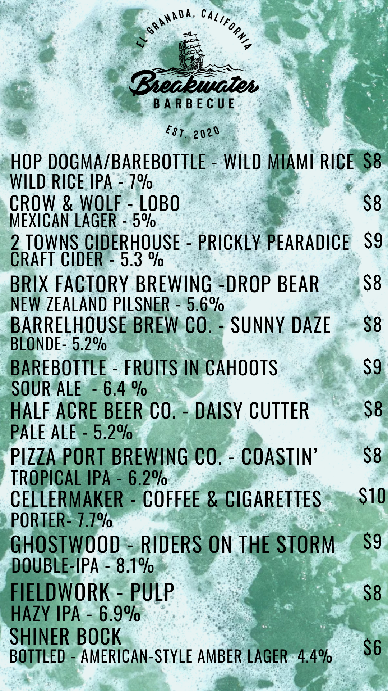
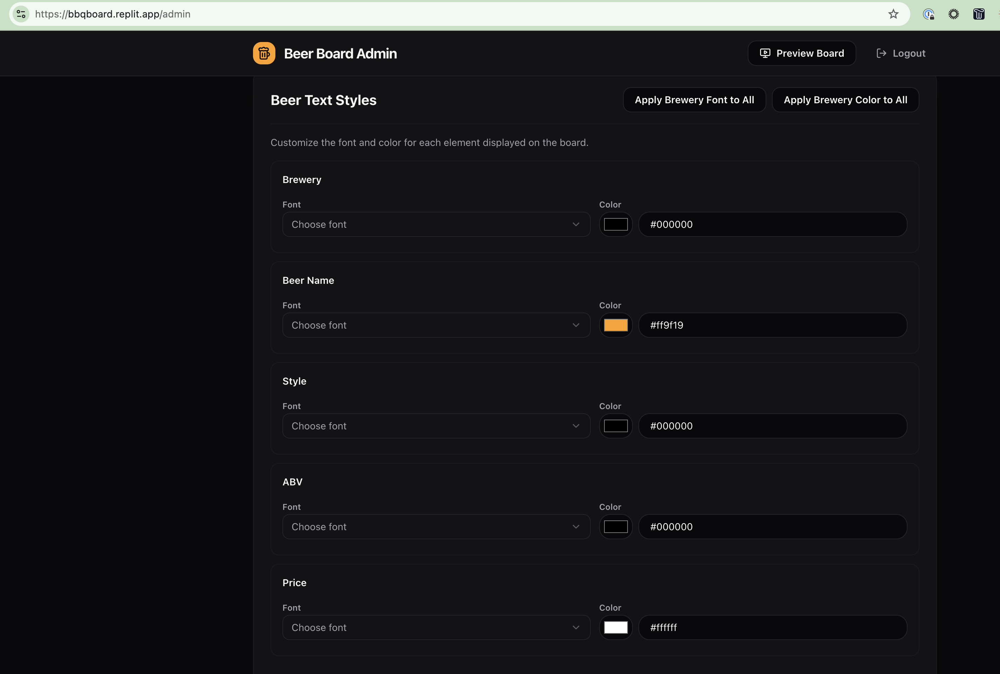

# Beer Board — Digital Tap List Display

A full-stack digital beer board built for Breakwater Barbecue. Designed to run on a Fire TV Stick driving a wall-mounted TV in portrait orientation. Includes a mobile-friendly admin panel and a self-documenting REST API.

<p align="center">
  
  &nbsp;&nbsp;&nbsp;&nbsp;
  
</p>

---

## Features

### TV Display (`/board`)
- Full-screen tap list auto-sized to any viewport
- Configurable rotation (0° / 90° / 180° / 270°) to match how the TV is physically mounted
- Landscape orientations render a 2-column layout with a colored divider
- Auto-refreshes beer data every 30 seconds — no manual intervention needed
- Custom background image with adjustable overlay opacity
- Per-element Google Fonts and colors (Brewery, Beer Name, Style, ABV, Price)
- Uploaded restaurant logo with adjustable sizing

### Admin Panel (`/admin`)
- Password-protected (single shared password)
- Add, edit, delete, and drag-to-reorder tap entries
- Upload background image and logo
- Visual font picker with 15 presets + custom Google Font input
- Per-element color pickers
- Visual board orientation selector with miniature TV diagrams
- Overlay toggle and opacity slider
- "Apply Brewery Font/Color to All" shortcuts
- Mobile-friendly — manage the board from your phone

### API Docs (`/docs`)
- Interactive endpoint reference with request/response examples
- Try-it-out functionality for every endpoint

---

## Tech Stack

| Layer | Technology |
|-------|-----------|
| Frontend | React 19, Vite, Tailwind CSS v4, shadcn/ui |
| Backend | Express 5, TypeScript |
| Database | PostgreSQL, Drizzle ORM |
| API Spec | OpenAPI 3.1, Orval (codegen) |
| Data Fetching | TanStack React Query (via Orval) |
| Drag & Drop | @hello-pangea/dnd |
| Monorepo | pnpm workspaces |
| Build | esbuild (API server), Vite (frontend) |

---

## Project Structure

```
├── artifacts/
│   ├── api-server/          # Express REST API
│   │   └── src/
│   │       ├── app.ts       # Express app setup, static file serving
│   │       ├── index.ts     # Entry point, migrations, listen
│   │       ├── routes/      # Route handlers (beers, settings, auth, upload)
│   │       └── middleware/   # Auth middleware
│   └── beer-board/          # React + Vite frontend
│       └── src/
│           ├── pages/       # Board, Admin, Login, ApiDocs, Landing
│           └── components/  # UI components (admin forms, board layout)
├── lib/
│   ├── api-spec/            # openapi.yaml + Orval config
│   ├── api-client-react/    # Generated React Query hooks
│   ├── api-zod/             # Generated Zod validation schemas
│   └── db/                  # Drizzle schema + DB connection
├── uploads/                 # User-uploaded images (background, logo)
└── scripts/                 # Seed data utilities
```

---

## Environment Variables

| Variable | Required | Description |
|----------|----------|-------------|
| `DATABASE_URL` | Yes | PostgreSQL connection string |
| `ADMIN_PASSWORD` | Yes | Password for the admin panel |
| `PORT` | Yes | Port for the API server (set automatically on most platforms) |
| `NODE_ENV` | No | Set to `production` for production builds |

---

## Local Development

### Prerequisites
- Node.js 20+
- pnpm 9+
- PostgreSQL 15+

### Setup

```bash
# Clone and install
git clone <repo-url> && cd beer-board
pnpm install

# Configure environment
cp .env.example .env
# Edit .env with your DATABASE_URL and ADMIN_PASSWORD

# Push database schema
cd lib/db && npx drizzle-kit push --force && cd ../..

# (Optional) Seed sample data
pnpm --filter @workspace/api-server run seed

# Start development servers
pnpm --filter @workspace/api-server run dev &
pnpm --filter @workspace/beer-board run dev
```

The API server runs on the port specified by `PORT`. The Vite dev server proxies API requests to it.

### Regenerating API Client

If you modify `lib/api-spec/openapi.yaml`:

```bash
cd lib/api-spec && npx orval
```

This regenerates the React Query hooks in `lib/api-client-react/` and Zod schemas in `lib/api-zod/`.

---

## Production Build

```bash
# Build everything
pnpm run build

# This produces:
#   artifacts/api-server/dist/index.cjs    — bundled API server
#   artifacts/beer-board/dist/public/      — static frontend files
```

The API server serves the frontend static files from `dist/public/` in production, so you only need to run the API server process.

```bash
NODE_ENV=production node artifacts/api-server/dist/index.cjs
```

---

## Deploying on Railway

[Railway](https://railway.app) is a good fit because it supports PostgreSQL as a managed add-on and can run the single Node.js process.

### Step-by-step

1. **Create a Railway project** and add a **PostgreSQL** service. Copy the connection string it provides.

2. **Add a web service** from your Git repo (GitHub, GitLab, etc.).

3. **Set environment variables** in the Railway service settings:

   | Variable | Value |
   |----------|-------|
   | `DATABASE_URL` | *(paste the Railway Postgres connection string)* |
   | `ADMIN_PASSWORD` | *(choose a strong password)* |
   | `PORT` | `3000` *(Railway sets this automatically — only set if needed)* |
   | `NODE_ENV` | `production` |

4. **Deploy.** Railway auto-detects the `start` script from `package.json`. If you want to customize, you can set these in Railway settings:

   | Setting | Value |
   |---------|-------|
   | Build Command | `pnpm run build:railway` |
   | Start Command | `pnpm start` |

   By default Railway will use `pnpm run build` + `pnpm start` from the root `package.json`, which handles everything.

5. **Generate a domain.** In the Railway service settings, go to **Settings > Networking > Generate Domain** to get a public URL.

6. Visit `/admin` to log in and start adding beers.

### Notes for Railway
- The `build:railway` script includes `drizzle-kit push` so the database schema is created/updated on every deploy.
- Uploaded images (background, logo) are stored in the `uploads/` directory. On Railway this is ephemeral storage — files are lost on redeploy. For persistent uploads, configure an S3-compatible object store and update the upload routes.
- Railway's free tier includes a small Postgres instance which is more than enough for a beer board.

---

## Deploying on Other Platforms

The same pattern works on **Render**, **Fly.io**, or any platform that can run a Node.js process and provide a Postgres database:

1. Provision a Postgres database.
2. Set the environment variables above.
3. Build with `pnpm install && pnpm run build`.
4. Run the DB migration: `cd lib/db && npx drizzle-kit push --force`.
5. Start with `node artifacts/api-server/dist/index.cjs`.

---

## Fire TV Setup — HTML5 Wrapper App

To display the board on a Fire TV Stick as a dedicated kiosk-style app, you have two options:

### Option A: Silk Browser Kiosk (Simplest)

1. On the Fire TV, open **Amazon Silk Browser**.
2. Navigate to your board URL: `https://your-domain.com/board`
3. The browser will full-screen the page. The board auto-rotates content for portrait TVs.
4. To prevent the screen from sleeping, enable **Settings > Display & Sounds > Screen Saver > Never**.

This works but the Fire TV can exit Silk unexpectedly. For a more robust setup, use Option B.

### Option B: Android WebView Wrapper (Recommended)

Package the board URL into a minimal Android APK that launches a full-screen WebView. This prevents accidental exits and starts automatically on boot.

#### Prerequisites
- Android Studio (or command-line Android SDK)
- JDK 17+

#### 1. Create the Android Project

Create a new Android project with an empty Activity. Set minimum SDK to API 22 (Fire OS 5+).

**`app/src/main/AndroidManifest.xml`:**
```xml
<?xml version="1.0" encoding="utf-8"?>
<manifest xmlns:android="http://schemas.android.com/apk/res/android"
    package="com.breakwater.beerboard">

    <uses-permission android:name="android.permission.INTERNET" />
    <uses-permission android:name="android.permission.RECEIVE_BOOT_COMPLETED" />

    <application
        android:label="Beer Board"
        android:icon="@mipmap/ic_launcher"
        android:theme="@style/Theme.AppCompat.NoActionBar">

        <activity
            android:name=".MainActivity"
            android:exported="true"
            android:screenOrientation="landscape"
            android:configChanges="orientation|screenSize|keyboardHidden"
            android:keepScreenOn="true">
            <intent-filter>
                <action android:name="android.intent.action.MAIN" />
                <category android:name="android.intent.category.LAUNCHER" />
                <category android:name="android.intent.category.LEANBACK_LAUNCHER" />
            </intent-filter>
        </activity>

        <receiver
            android:name=".BootReceiver"
            android:exported="true">
            <intent-filter>
                <action android:name="android.intent.action.BOOT_COMPLETED" />
            </intent-filter>
        </receiver>

    </application>
</manifest>
```

#### 2. Main Activity — Full-Screen WebView

**`app/src/main/java/com/breakwater/beerboard/MainActivity.java`:**
```java
package com.breakwater.beerboard;

import android.app.Activity;
import android.os.Bundle;
import android.view.View;
import android.view.WindowManager;
import android.webkit.WebSettings;
import android.webkit.WebView;
import android.webkit.WebViewClient;

public class MainActivity extends Activity {

    private static final String BOARD_URL = "https://your-domain.com/board";

    @Override
    protected void onCreate(Bundle savedInstanceState) {
        super.onCreate(savedInstanceState);

        getWindow().addFlags(WindowManager.LayoutParams.FLAG_KEEP_SCREEN_ON);
        hideSystemUI();

        WebView webView = new WebView(this);
        setContentView(webView);

        WebSettings settings = webView.getSettings();
        settings.setJavaScriptEnabled(true);
        settings.setDomStorageEnabled(true);
        settings.setCacheMode(WebSettings.LOAD_DEFAULT);
        settings.setMediaPlaybackRequiresUserGesture(false);

        webView.setWebViewClient(new WebViewClient());
        webView.loadUrl(BOARD_URL);
    }

    private void hideSystemUI() {
        getWindow().getDecorView().setSystemUiVisibility(
            View.SYSTEM_UI_FLAG_IMMERSIVE_STICKY
            | View.SYSTEM_UI_FLAG_FULLSCREEN
            | View.SYSTEM_UI_FLAG_HIDE_NAVIGATION
            | View.SYSTEM_UI_FLAG_LAYOUT_STABLE
            | View.SYSTEM_UI_FLAG_LAYOUT_HIDE_NAVIGATION
            | View.SYSTEM_UI_FLAG_LAYOUT_FULLSCREEN
        );
    }

    @Override
    public void onWindowFocusChanged(boolean hasFocus) {
        super.onWindowFocusChanged(hasFocus);
        if (hasFocus) hideSystemUI();
    }
}
```

#### 3. Boot Receiver — Auto-Start on Power On

**`app/src/main/java/com/breakwater/beerboard/BootReceiver.java`:**
```java
package com.breakwater.beerboard;

import android.content.BroadcastReceiver;
import android.content.Context;
import android.content.Intent;

public class BootReceiver extends BroadcastReceiver {
    @Override
    public void onReceive(Context context, Intent intent) {
        if (Intent.ACTION_BOOT_COMPLETED.equals(intent.getAction())) {
            Intent launch = new Intent(context, MainActivity.class);
            launch.addFlags(Intent.FLAG_ACTIVITY_NEW_TASK);
            context.startActivity(launch);
        }
    }
}
```

#### 4. Build and Sideload

```bash
# Build the APK
cd android-project
./gradlew assembleRelease

# The APK is at:
# app/build/outputs/apk/release/app-release.apk

# Sideload to Fire TV via ADB
adb connect <fire-tv-ip>:5555
adb install app-release.apk
```

#### 5. Fire TV Configuration

After installing:
1. The app appears in **Apps** on the Fire TV home screen.
2. Launch it — the board loads full-screen in landscape. The web app handles the portrait rotation via CSS.
3. On reboot, the `BootReceiver` auto-launches the app.
4. To prevent Fire TV from going to sleep: **Settings > Display & Sounds > Screen Saver > Never**.

#### Tips
- Replace `https://your-domain.com/board` in `MainActivity.java` with your actual deployed URL.
- The board rotation setting in the admin panel controls how the content is oriented. Set it to **270°** for a standard portrait TV mounted with the power cable at the top.
- The board auto-refreshes every 30 seconds, so menu changes made in the admin panel appear on the TV within 30 seconds.
- For offline resilience, the WebView caches the page. If the network drops briefly, the last-loaded board remains visible.

---

## API Reference

Full interactive API documentation is available at `/docs` when the app is running.

### Quick Reference

| Method | Endpoint | Auth | Description |
|--------|----------|------|-------------|
| `POST` | `/api/admin/login` | No | Get auth token |
| `GET` | `/api/beers` | No | List all beers |
| `POST` | `/api/beers` | Yes | Add a beer |
| `PATCH` | `/api/beers/:id` | Yes | Update a beer |
| `DELETE` | `/api/beers/:id` | Yes | Delete a beer |
| `PATCH` | `/api/beers/reorder` | Yes | Reorder beers |
| `GET` | `/api/settings` | No | Get board settings |
| `PATCH` | `/api/settings` | Yes | Update settings |
| `POST` | `/api/upload/background` | Yes | Upload background image |
| `POST` | `/api/upload/logo` | Yes | Upload logo image |

### Authentication

```bash
# Get a token
curl -X POST https://your-domain.com/api/admin/login \
  -H "Content-Type: application/json" \
  -d '{"password": "your-admin-password"}'

# Use the token
curl https://your-domain.com/api/beers \
  -H "Authorization: Bearer <token>"
```

Tokens are HMAC-based and tied to the `ADMIN_PASSWORD`. Changing the password invalidates all existing tokens.

---

## License

MIT
